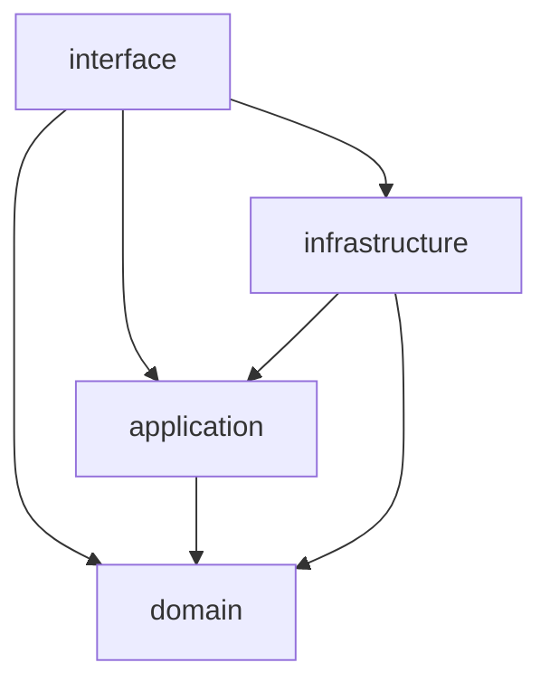

# go-minimum-crud
Golangで実装された最小限のCRUDアプリ

## コマンド

### コードフォーマット
```
gofmt -l -s -w backend/src
```

### テスト用MySQLコンテナを起動
```
docker compose build mysql

docker compose up mysql
```

### バックエンドの開発用のコンテナを起動
```
docker compose build backend-devel

docker compose up backend-devel
```

## テストリクエストコマンド
```
curl -i "localhost:8080/users"

curl -i "localhost:8080/user?id=1"

curl -i -X POST -H "Content-Type: application/json" -d '{"name":"岸辺露伴","email":"kishiberohan@jojo.com"}' "127.0.0.1:8080/user"

curl -i -X PATCH -H "Content-Type: application/json" -d '{"name":"岸辺露伴","email":"dodkdkdkdkdkishiberohan@jojo.com"}' "127.0.0.1:8080/user?id=2"

curl -i -X DELETE "localhost:8080/user?id=1"
```

## パッケージ構成

### 各種パッケージ間の依存関係のグラフ



### domain (ドメイン層)
- ドメインモデル
- ドメインサービス
  - ビジネスロジックは全てここに書く

### application (アプリケーション層)
- アプリケーションサービス
  - 処理フローの制御のみ
    - リポジトリの参照
    - ビジネスロジックや他のサービスの呼び出し
    - それらの逐次処理
- リポジトリのインターファース

### infrastructure (インフラ層)
- リポジトリの実装 (dao)

### interface (インタフェース層)
- アダプタ
  - DTOなどドメイン外のオブジェクトとドメインモデル間の変換を行う
- route
- DI
  - moduleパッケージで制御
